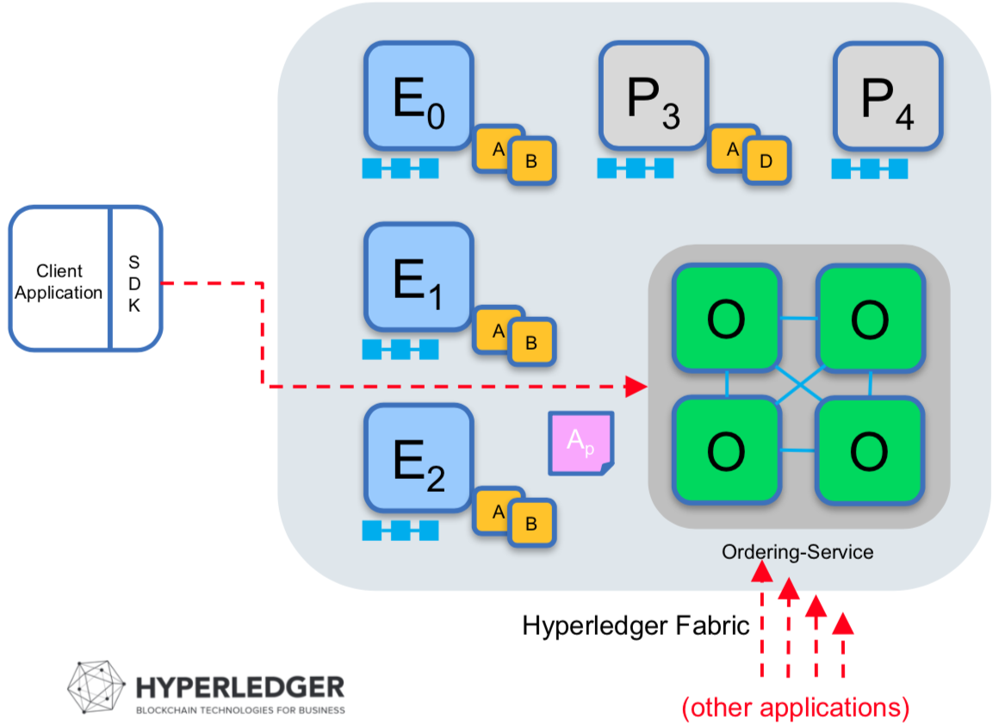

# Hyperledger Fabric v1.0 - Deep Dive

## What is Hyperledger Fabric

### Hyperledger

* Open Source
* For Cross-Industry blockchain (Common)
* Hosted by The Linux Foundation

### Hyperledger Fabric
* Blockchain Framework
* Hyperledger Project 에서 처음으로 incubation 상태를 벗어난 Project
* Key technical features
	* Shared ledger
	* Chaincode (SmartContract)
	* Privacy and permissioning through membership services
		* Public 블록체인은 모든 데이터를 볼 수 있다.
		* 합의된 사용자만 네트워크에서 Transaction을 일으킨다고 하더라도 비지니스 차원에서 특정 사용자만 데이터를 볼 수 있도록 해야 한다.
		* ACL
	* Modular architecture and flexible hosting options
		* 이론적으로는 hyperledger를 구성하는 모든 컴포넌트는 내맘대로 만들어서 끼어넣을 수 있다.
		* Membership Service Provider
			* Fabric-CA
			* External
		* Orderer
			* Solo
			* kafka
			* SBFT (likely PBFT)

## Reference Architecture

* IDENTITY
	* ACL
	* Audit
* LEDGER, TRANSACTIONS
	* Distributed Ledger
* SMART CONTRACT
	* Programmable ledger (likely Procedure)
	* Run business logic
* APIs, Events, SDKs
	* Go
	* Node.js

## Overview of v1.0 Design Goals

* 비지니스 프로세스를 반영하기 쉽도록 개선
	* ACL
	* Endorsement
* network와 chaincode를 동적으로 upgarde
* 기타 등등...

## Architecture

### v0.6 Architecture

* PBFT를 사용, 노드가 최소 4대이고 그중에 3대만 만족하면 데이터가 저장되는 구조
* Peer가 체인코드 실행, leader 관리, 합의 까지 모든 것을 전담
* Membership 공인인증서를 발행하지만, 없어도 문제 없었음
* 클라이언트 입장에서 membership service가 있으면 enroll, 인증서 받기
* 인증서와 Transaction을 실어서 SmartContract를 실행

### v1.0 Architecture

* 하나의 트랜잭션을 처리하는데 7단계를 거쳐야 함
* Consensus의 확장, 7단계를 다 거치면 하나의 Consensus 수행되는 구조
* 단계
    1. 클라이언트가 MSP에 enroll, 인증서 발급
    2. 인증서 정보, SmartContract Method와 Argument를 실어서 endorser에 transaction proposal
        * endorser는 validation 하거나 서명을 해주는 노드들
    3. validation
        * 사용자 정보 검증 등
        * Execute chaincode
    4. 검증 완료 후 검증된 response를 반환
    5. 클라이언트가 모든 endorser들에게 검증을 받았다고 판단하면 orderer에게 submit
    6. Orderer 는 체인코드의 버전, 채널 별로 transaction 을 분류 및 정렬 후 블록 생성
    7. Orderer가 commiter에게 block을 deliver (batch)
    8. commiter는 validation후 block을 append

## Components

### Orderer
* Transaction을 정렬하는 역할
* Genesis of a network
    * Orderer를 통해 채널 생성을 하는것이 Fabric Network의 시작
	* 모든 Configuration 트랜잭션을 처리하여 네트워크 정책 (독자, 작성자, 관리자)을 설정
* Orderer를 Kafaka로 운영할 경우 Orderer라고 하면..
    * Kafka 는 3개 이상, Zookeeper도 3개, Order service가 별도의 Container로써 kafka마다 하나씩 붙어야 하므로 최소 9개 Container가 뜬다.
    * HA를 요구하는 Production 환경에서 Kafka Broker는 보통 9개이상을 권장
    * Zookeeper는 5개 (너무 많으면 Network 부하가 많아져서 좋지 않음)
    * 여러 기업이 운영하는 Blockchain 환경이라면 Orderer는 어디에..?
        * Cloud
        * peer는 원장을 저장하니까 사내에

### Peer
* Endorser
	* Transaction을 실행하고 보증
* Commiter
	* Transaction의 결과를 검증
* Endorser 와 commiter는 하나의 컨테이너이고, 컨테이너가 실행될 때 configuration으로 endorser 역할을 할지 말지 지정하게 되어 있음
* Event 발행
	* After execute chaincode
	* After append block
* Gossip Network (Protocol)

### Ledger
* Key-value store
* Default level DB
* External로 Couch DB를 사용할 수 있음
* RDB도 지원 예정
* Couch DB를 쓰는 이유
    * 기존의 key-value db로는 조회용 데이터를 만들기 쉽지 않음
    * Couch DB는 다양한 query를 쓸 수 있는 환경을 만들어 줌
    * 원칙은 SC를 통해서 데이터를 query해야 하지만 단순한 통계, 모니터링 화면등을 위해서는 Couch db를 쓰는것도 방법이 될 수 있음
* RWSet (read write set): 가지고 있던 데이터와 써야하는 데이터의 조합
    * Transaction의 내용은 채널명 SmartContract 명, 버전, argument 등이 들어간다.
    * 그 이외에 Block안에는 RWSet이 들어가는데...
    * RWSet은 Transaction 생성 과정에서 2번에 해당하는 Execute Chaincode 에서 생성된다.
        * Peer는 자기가 가지고있는 Ledger의 데이터(Read set)와 써야하는 데이터(Write set / created execute cc)을 메모리에 올린다.
        * 중간 과정들이 수행된 후 최종적으로 commiter가 validation check를 할 때, 이것 저것 비교한 후 rwset에 문제가 없으면 그걸 그대로 블록에 저장
    * Fabric 의 block 생성 단계는 db의 2 phase commit 과 유사하다. (DB가 분산 DB 일 뿐)
    * 문서에 보면 Read셋이 바뀌더라도 어떤 것을 기준으로 update 한다는 등 정의된 문서가 있다고 함...
    * Key-value db에서는 하나의 key에 대해서 value가 변하면 덮어 쓰는게 아니라 append 하고 get 하면 최신의 데이터를 주게 되는데 
    * rwset에서 read set은 전체 index에 해당하는 데이터를 다 가지고 오도록 되어있다.

### Channels
* 내가 거래하고 싶은 peer 들의 조합
* 이해 당사자들끼리만 통신할 수 있는 통신 채널
* 하나의 peer는 여러개의 채널에 join 할 수 있다.
* ledger는 채널 별로 관리
* 하나의 채널에는 여러개의 chaincode를 deploy할 수 있다.

### MSP(membership service provider)
* 조직을 나누는 기술
* Identity의 역할
    * 인증서 발급
    * 사용자 등록
    * peer간 통신시 peer validation check 
    * Client가 orderer를 호출 할 때 해도 되는 orderer인지 검증 등
* MSP ID로 조직을 구분해서 나누고 MSP ID 하나당 Fabric CA가 하나씩 존재
* 내가 인증을 받기 위해서 어디에 어느 API를 호출해야 하는지를 구분 (조직 구분)
* MSP가 identity를 해주는 대상
    * Application
    * user
    * peer
    * Orderer
* 구현체는 Fabric CA를 쓸 수도 있지만, 우리 조직의 CA를 쓸 수 있음

### Fabric-CA
* MSP interface의 기본 구현체
* Ecert, Tcert를 발행
	* 사용자가 한 명 등록되면 Ecert (Enrollment Certificate) 를 하나 발급
	* Client는 transaction을 하나 생성할 때마다 Ecert 에서 특정 데이터를 추출해서 TCert(Transaction Certification)을 생성
	* Transaction 마다 isolation 하는 역할
* Ecert를 가지고 내용을 조회할 수 있다.

### Crypto Service Provider
* PKI 인증서를 만들어 주는 구현체
* Fabric-CA 가 사용하는 모듈
* 기본 구현체가 아닌 다른 것을 가져다 쓸 수 있다.

## Fabric Network

### Bootstrapping a Network
* Orderer가 제일 처음 뜸
* Orderer가 control 할 member들을 결정
* Network에 참여할 Peer 의 수 결정
* 아직 Peer는 Orderer 또는 다른 Peer들과 연결되지는 않음

### Setting up Channels, Policies, and Chaincodes
* Orderer가 올라왔으면 Orderer가 Channel을 생성
* 이후 Peer 가 Orderer에 채널에 join 요청
* 다음으로 Channel에 chaincode를 deploy
* Chaincode를 instanciate할 때 Endorsement policy를 argument 로 배포

### Consensus redefined
* Consensus = Transaction endorsement + ordering + validation
* Transaction endorsement: 참여자 들이 Transaction 을 처리하는 기준
* Ordering: 처리해야 하는 Transaction 들을 시간순서대로 채널별 Chaincode 별로 정렬
* Validation: endorsement를 만족하는지, ordering 되어 있는지, chaincode 내용이 맞는지 등등 검증

### Transaction Endorsement

* Endorsement는 Transaction이 Endorser에 실행된 후 문제가 없음을 서명한 결과
* Endorsement policy는 참여자들에 의해서 받아들여져야 하는 Transaction의 요구사항
* Endorsement policy는 채널의 체인 코드 인스턴스화 중에 지정
* 각각의 채널 별 체인 코드는 다른 Endorsement policy를 가질 수 있음

## Sample Transaction: step 1/7

### Step 1/7 - Propose transaction

> 아래 소개된 Fabric Network에서 Endorsement policy(Ap)는 chaincode A를 instantiate 할 때 배포되었다고 가정한다.

* Application propose transaction
	* Client application submits a transaction proposal for chaincode A. It must target therequiredpeers{E0, E1, E2}

### Step 2/7 - Execute proposal

* Endorsers Execute Proposals
	* E0, E1, E2는 각각 proposed transaction을 실행
	* 이때 원장에 update는 일어나지 않음
	* 각각의 실행은 원장으로부터 Read set을 transaction의 실행으로부터 write set 을 생성

### Step 3/7 - Proposal response

* Application receives responses
	* endorser는 RWSet에 서명을 한 후, Application에 반환

### Step 4/7 - Order transaction

* Application submits responses for ordering
	* 모든 endorser로 response를 받은 Application은 해당 response를 orderer에게 transaction으로 제출
	* 이 때, 다른 응용 프로그램에서 제출 한 트랜잭션과 병렬 처리됨

### Step 5/7 - Deliver transaction

* Orderer delivers to all committing peers
	* Orderer는 Transaction을 블록으로 만들어서 모든 peer에게 배포
	* Peer는 gossip protocol을 상용하여 다른 peer 에게 전파

### Step 6/7 - Validate Transaction

* Committing peers validate transactions
	* Committing peer 들은 Transaction을 endorsement policy에 대해서 검증하고, RWset이 유효한지 확인.
	* 검증이 완료되면 Transaction은 원장에 쓰여지고, WorldState를 upate

### Step 7/7 - Notify Transaction

* Committing peers notify applications
	* Application은 Transaction의 실행의 성공/실패와 Block이 원장에 추가 될 때 event를 받도록 할 수 있다.

## Single Channel Network

* 0.6의 PBFT 와 비슷
* 모든 Peer들은 같은 채널로 연결되어 있음
* 모든 Peer는 같은 chaincode를 가지고, 같은 원장을 유지함

## Multi-Channel Network

* Peer 들은 여러 채널을 통해 복수의 원장을 가질 수 있음
* 클라이언트는 채널 명과 Chaincode 명을 실어서 Transaction을 제출
