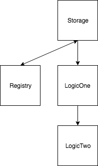

# The Basics of Upgradable Proxy Contracts in Ethereum

> 아래 글을 개인적인 공부 목적으로 번역한 글입니다. 문제시 삭제될 수 있습니다.
>
> * https://medium.com/@blockchain101/the-basics-of-upgradable-proxy-contracts-in-ethereum-479b5d3363d6

Smart Contract는 Ethereum 블록 체인에 배포되면 변경이 불가능하므로 업그레이드 할 수 없다. 코드를 다른 계약으로 재구성함으로써 스토리지를 동일하게 유지하면서 로직을 업그레이드 할 수 있다. 사실, 업그레이드 가능한 Smart Contract는 인기를 얻고 있으며 Jack Tanner는 사용 된 모든 기술을 설명하는 [좋은 글](https://blog.indorse.io/ethereum-upgradeable-smart-contract-strategies-456350d0557c)을 작성했다. 그러나 이렇게 말하면서 나는 계약을 전혀 업그레이드하지 말아야한다고 생각한다. 좋은 예로 ICO를 시작할 때 토큰 로직을 업그레이드 할 수 있다는 것에 동의하지 않는다. 왜냐하면 소유주가 약속을 되돌릴 수 있기 때문이다.

upgradability 토론을 떠나서 이 글에서는 nick johnson이 처음으로 만든 프록시 기술에 중점을 둘 것이다.

아이디어는 1 개의 Storage Contract, 1 개의 Registry Contract 및 1 개의 Logic Contract를 갖는 것이다. Logic Contract에 새 기능을 추가하거나 기존 기능을 업그레이드 해야 할 때, 현재 Logic Contract를 상속 받아 새로운 Logic Contract를 생성한다.



`Storage` Contract는 단순히 상태를 보유하고 가능한 한 간단하게 만듭니다.

```java
pragma solidity ^0.4.21;

contract Storage {
    uint public val;
}
```

`Registry` Contract는 `Logic` Contract에 대한 프록시를 제공하여 상속 된 'Storage' Contract의 상태를 수정한다.

```java
pragma solidity ^0.4.21;

import './Ownable.sol';
import './Storage.sol';

contract Registry is Storage, Ownable {

    address public logic_contract;

    function setLogicContract(address _c) public onlyOwner returns (bool success){
        logic_contract = _c;
        return true;
    }

    function () payable public {
        address target = logic_contract;
        assembly {
            let ptr := mload(0x40)
            calldatacopy(ptr, 0, calldatasize)
            let result := delegatecall(gas, target, ptr, calldatasize, 0, 0)
            let size := returndatasize
            returndatacopy(ptr, 0, size)
            switch result
            case 0 { revert(ptr, size) }
            case 1 { return(ptr, size) }
        }
    }
}
```

`Registry` Contract에는 어떤 `Logic` Contract를 사용해야하는지 알아야 한다. setLogicContract 함수를 사용하여 이를 설정할 수 있다. 우리는 단순한 Ownable.sol을 사용하여 admin 만 setLogicContract 함수를 호출 할 수 있도록했다. [assembly](https://solidity.readthedocs.io/en/v0.4.24/assembly.html)의 fallback function은 일부 사용자에게는 익숙하지 않을 수 있지만 이 특정 코드는 실제로 프록시 계약의 표준입니다. 기본적으로 내부 Storage를 외부 계약으로 변경할 수 있다. Ownable Contract 이전에 Storage를 초기화하는 것도 매우 중요하다. 이 시퀀스를 잘못 얻는 것은 재앙이다. 왜 그런가?

delegatecall() assembly 코드는 편리하지만 위험하다. 그러니 그걸 가지고 살아 가기 전에 어떤 일이 일어나는지 알아야 한다.

다음으로 logic 부분에 대해 이야기 해보자.


```java
pragma solidity ^0.4.21;

import './Storage.sol';

contract LogicOne is Storage {
    function setVal(uint _val) public returns (bool success) {
        val = 2 * _val;
        return true;
    }
}
```

위의 코드는 간단하다. `LogicOne` Contract는 "val"스토리지를 수정하기위한 Contract 다.


## Implementation

1. Registry.sol과 LogicOne.sol을 모두 배포한다.

2. LogicOne이 배포 한 주소를 Registry.sol에 등록한다. 즉,

```
Registry.at(Registry.address).setLogicContract(LogicOne.address)
```

3. 우리는 LogicOne ABI를 사용하여 레지스트리 계약에서 "val" Storage를 수정한다.

```
LogicOne.at(Registry.address).setVal(2)
```

4. LogicOne을 LogicTwo로 업그레이드 할 준비가되면 LogicTwo 계약을 전개하고이를 가리 키도록 레지스트리 계약을 업데이트한다.

```
Registry.at(Registry.address).setLogicContract(LogicTwo.address)
```

5. 이제 LogicTwo로 레지스트리의 스토리지를 제어 할 수 있다.

```
LogicTwo.at(Registry.address).setVal(2)
```

당장 코드에 뛰어 들기보다는 우리가하고있는 일을 소화하는 데 약간의 시간이 걸리는 것이 중요합니다. LogicOne 및 LogicTwo의 저장소는 Registry contract의 저장소와 동일하지 않습니다. 그것들은 스토리지 설계에 의해서만 관련이 있습니다 (이것은 매우 중요합니다).

## Conclusion

이 기사에 사용 된 코드는 github에서 찾을 수 있으며 주로 개념적 설명 목적으로 만 사용됩니다. 나는 많으 복잡성을 줄였고, 뼈대를 만들기위해서 확인했다. 프로덕션을 위해 사용하려는 경우, 귀하의 목적을 위해 더 많은 주의를 기울이는 것을 제안합니다.