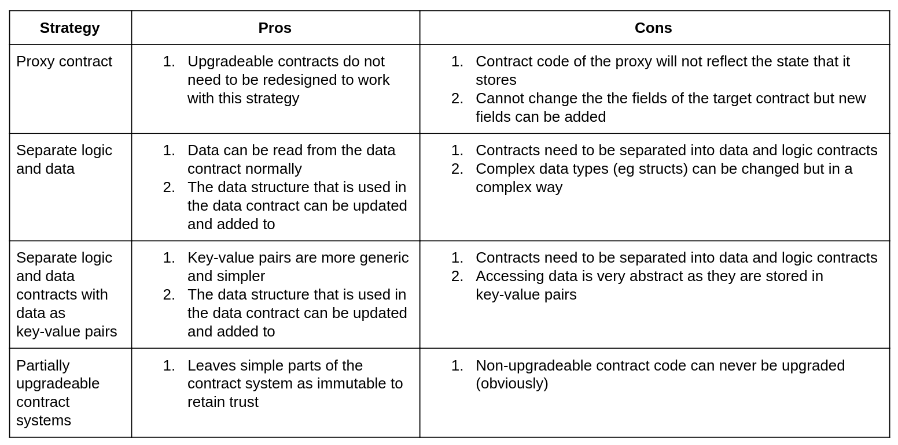

# Summary of Ethereum Upgradeable Smart Contract R&D

> 아래 글을 개인적인 공부 목적으로 번역한 글입니다. 문제 시 삭제될 수 있습니다.
>
> * https://blog.indorse.io/ethereum-upgradeable-smart-contract-strategies-456350d0557c

이 기사는 업그레이드 가능한 Ethereum 스마트 계약 분야의 연구 및 개발을 요약 한 것이다. 현재까지 연구를 중앙 집중화하고 이 기술적인 논의를 계속하는 데 유용한 자료가 될 것이다. 또한 제안 된 여러 가지 전략의 장단점에 대한 요약표를 만들었다. 귀하가 이 분야의 R&D 분야에서 일하고 있다면이 표에 대한 귀하의 동의, 불일치 또는 의견, 전략에 대한 설명에 대해 이 기사에 의견을 말해라.

몇 달 전에 AvanceHub 프로젝트의 일부로 기여한 것 외에도 이 기사에는 새로운 기술 연구 개발이 추가되지 않았습니다. 이 기사의 전략 순서는 자신이나 개발자 커뮤니티의 채택 또는 선호도 수준으로 해석해서는 안됩니다. indorse.io 프로젝트의 일환으로, 이 기사는 우리가 필요하다고 생각하는 업그레이드 가능한 전략을 수립하기 시작할 것입니다. 
2018 년 6 월 업데이트 : indorse.io는 계속 프록시 계약 패턴을 사용하는 계약을 조사하고 배포했습니다.

아래쪽에는 지금까지의 R & D 링크의 포괄적 인 목록이 될 것입니다.

## 100% Upgradeable Mechanisms
보다 현명한 계약 인프라를 사용하면 새로운 Logic으로 완전히 대체 될 수 있는 Smart Contract를 생성 할 수 있다. 두 가지 주요 전략이 있다: Proxy와 Logic과 Data를 다른 Contract로 분리한다. 계약에서 Logic과 Data를 분리하는 방법은 두 가지가 있다.

두 방법 모두가 해결하고자 하는 근본적인 문제는 Contract의 상태에 대한 액세스를 유지하면서 Contarct의 Logic을 업데이트하는 방법이다.

아래에서 이러한 전략이 어떻게 작동하는지 간략하게 요약 했으므로 이 기사의 맨 아래에있는 최신 리소스로 이동하여 작업 방법을 자세히 익히도록 권장합니다 (특히 upgradeable contracts의 혼란의 시대를 시작하는 경우).

### Proxy Contracts
Proxy Contract는 delegatecall opcode를 사용하여 함수 호출을 target upgradeable contract로 전달한다. delegatecall은 함수 호출의 상태를 유지하므로, target contract의 Logic은 업데이트 될 수 있다. 그리고 State는 업데이트된 target contract의 logic을 사용하는 동안 Proxy Contract에 유지된다. delegatecall에 의해서, msg.sender는 프록시 계약자의 호출자로 유지된다.

최근의 비잔틴 하드 포크로 인해 함수 호출의 반환 크기에 액세스 할 수있게되었으므로 이 메서드는 이제 일반화 될 수 있습니다. (Nick Johnson이 처음 제안했을 때와 비교했을 때) 일반적인 proxy contract의 예는 Daonomic의 자료에서 볼 수 있으며 간단한 메커니즘을보다 자세히 설명하기 위해이 메커니즘에 대해 읽는 훌륭한 기사이기도합니다.

### Separate Logic and Data Contracts

### Separate Logic and Data Contracts with Data as Key-Value pairs

## Partially Upgradeable Strategies

## Other Challenges

## Conclusion
