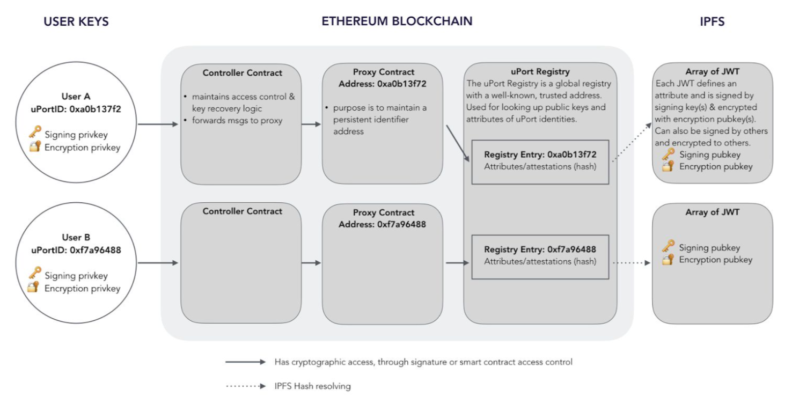

# UPORT: A PLATFORM FOR SELF-SOVEREIGN IDENTITY

> 본 Post는 uport white-paper를 정리한 것입니다. 상세한 내용은 원문을 참조 부탁드립니다.
>
> * http://blockchainlab.com/pdf/uPort_whitepaper_DRAFT20161020.pdf

## INTRODUCTION

### History

* 기존 온라인 인증시스템에 문제가 많음
	* centralized data를 양성해 해커의 표적이 된다.
* public/private key 암호화와 Blockchain 같은 decentralized 기술이 대안이 될 수 있음
* 공개키 암호화 기술은 생긴지 오래됐지만 사용자 접근성이 떨어져서 잘 사용되지 않았다.
	* Blockchain이 모든 것을 바꿔놨다. (역시 돈이 껴야..)
* 블록체인 지갑은 기술을 잘 알지못하면 사용하기 어렵다.
* 블록체인을 ID를 public-key와 연결시켜주는 분산 CA로 볼 수 있다. 
* Smart Contract는 key 관리를 도와줄 수 있다.

### Introduction to Uport

* uPort는 ehtereum 기반의 SSID System
* main component
	* Smart Contract
		* mobile app(pirvate key)을 분실 했을 때의 코어 로직 구현
	* Developer libraris
		* Support to develp 3rd-party app
	* mobile app
		* hold private(user) key
* key concepts
	* self-sovereign
		* Identities fully owned and controlled by creator.
	* decentralized
		* don't rely on centralized 3rd-parties
* off-chain data sotres
	* identity는 암호화되어 off-chain data sotre에 저장된다. (e.g. dorpbox, aws)

### Propose Use Cases

* End-user with uPort
	* 개인 신원, 평판, 데이터 및 디지털 자산을 소유하고 제어
	* 데이터를 상대방에게 안전하고 선택적으로 공개
	* 암호를 사용하지 않고 디지털 서비스를 이용
	* 청구, 거래 및 문서에 디지털 서명
	* 블록 체인에서 값을 제어하고 보냄
	* 분산 된 애플리케이션 및 Smart Contract와 상호 작용
	* 메시지와 데이터를 암호화
* Enterprises with uPort
	* 기업의 정체성을 확립
	* 새로운 고객 및 직원에게 쉽게 적용
	* 개선되고 이행적인 Know-Your-Customer 프로세스를 수립
	* 직원을위한 마찰이 적은 안전한 액세스 제어 환경을 구축
	* 민감한 고객 정보를 보유하지 않음으로써 책임을 줄임
	* 준수(compliance) 증가
	* 벤더 네트워크 유지

## TECHNICAL OVERVIEW

### Ethereum and Smart Contracts

* Ethereum 은 Smart Contract를 가지고 있고, 이것은 Smart Contract는 address를 참조하여 실행된다.
* User는 Samrt Contract가 deploy된 address로 transaction을 보내므로써 Smart Contarct를 호출할 수 있는데, 이때 function의 signagure와 input parameter를 같이 보내게 된다.

### uPort Technical Overview

* uPort identifier (Proxy contract; Ethereum smart contract address;)
	* 20-byte hexdecimal (0xFFFF_FFFF_FFFF_FFFF_FFFF)
	* globally unique
	* persistent identifier
	* Ethereum smart contract address
	* 트랜잭션을 중계
	* 이 메커니즘을 통해 ID가 Ethereum의 다른 Smart Contract와 상호 작용

* Proxy contract는 사용자의 private key(모바일 장치에 저장 된)와 application smart contract 사이의 간접적인 계층을 도입
	* 사용자가 proxy contarct를 유지하면서 private key를 교체할 수 있게 한다.
	* uPort identifier 대신 자신의 private key에 대응하는 public key를 사용하는 경우(일반적인 경우), 개인 키가 저장되어있는 장치를 잃어 버리면 식별자를 제어 할 수 없다.
* Contract contract
	* contain main access control logic
	* 복구 대리인의 리스트를 가지고있어, 사용자가 mobile을 잃어버린 경우 사용자의 ID 복구를 돕는다.
	* 대리인은 친구 및 가족과 같은 개인이거나 은행 및 신용 조합과 같은 기관 일 수 있다. 
	* 대리인의 쿼럼은 사용자의 신원을 복구하고 새 장치에 연결할 수 있다.

1. Controller Contract에 Recovery network가 저장되어 있다.
2. 사용자가 새 폰을 산다.
3. recovery network에 새로운 public key를 보낸다.
4. 2/3 이상이 동의한다.
5. Controller Contract가 사용자의 public key를 update 한다.
6. 사용자의 identity가 복구된다.

* Registry Contract를 사용하여 uPort identifier와 external data structure를 hash로 연결
	* hash는 Data Structure의 무결성을 보장하며 uPort identifier와의 연결은 스마트 계약으로 제어
	* Registry Contract에는 uPort 식별자와 IPFS(off-chain storage) 해시 간의 매핑이 포함
	* uPort Prxoy 만이 Registry Contract을 업데이트 할 권한을 가짐
* IPFS hash에 해당하는 data structure에는 이름, 프로필 image 등과 같은 프로필 정보와 public key가 포함될 수 있다.
	* data structure는 JSON 스키마 모음
	* 각 JSON 스키마는 개인 키로 디지털 서명되어 JSON 웹 토큰으로 만들어짐
	* 토큰은 off-chain attestation으로 사용
* attestation은 매우 일반적인 구조
	* 특정 신원이 다른 신원에 대한 주장을한다는 증거로 사용
	* public key가 특정 ID에 속한다는 self-signed certificate 일 수도 있다. 
	* attestation은 Twitter와 같은 서비스에 양방향 링크를 제공하여 사용자가 기존 소셜 네트워크를 활용할 수있게 해줌
* uPort 사용자가 암호화 키를 소유하고 있으면, Registry에 연결된 attributes와 attestations도 암호화 할 수 있다. 
	* 이렇게하면 profile data를 비공개로 유지하고 다른 ID의 public encryption keys로 암호화할 수 있다.

### Technical Components

**Smart Contract Components**

* Proxy Contract
	* 거래를 전달하는데 사용되는 최소 계약
	* Address는 uPort identity의 core identifier
* Controller Contract
	* Proxy Contract에 대한 접근 제어를 유지
* The ​Recovery Quorum Contract
	* 키 손실 시, 신원 복구에 이용
* The ​Registry Contract
	* uPort identifier와 그것과 관련된 off-chain data 속성 간의 암호화 바인딩을 유지 관리

**Data Components**

* Attestations(증명)
	* profile attributes 및 verifiable claims이 포함 된 서명 된 데이터 레코드
	* 오프 체인 상태로 저장
	* Digital Credential ??
* Selective disclosure
	* attributes와 attestations에 개인 정보 보호 계층을 추가하는 데이터를 암호화하는 메커니즘

**Developer Components**

* A ​Developer library
	* uPort를 dApp 또는 기존 디지털 서비스와 연결해주는 역할

**Mobile Components**

* ​Mobile application
	* 신원을 제어하고 표시하는데 사용되는 private key를 스마트 폰의 안전한 곳에 보관

**Server Components**

* Chasqui - messaging server
* Sensui - gas fueling server
* Infura RPC
* Infura IPFS

